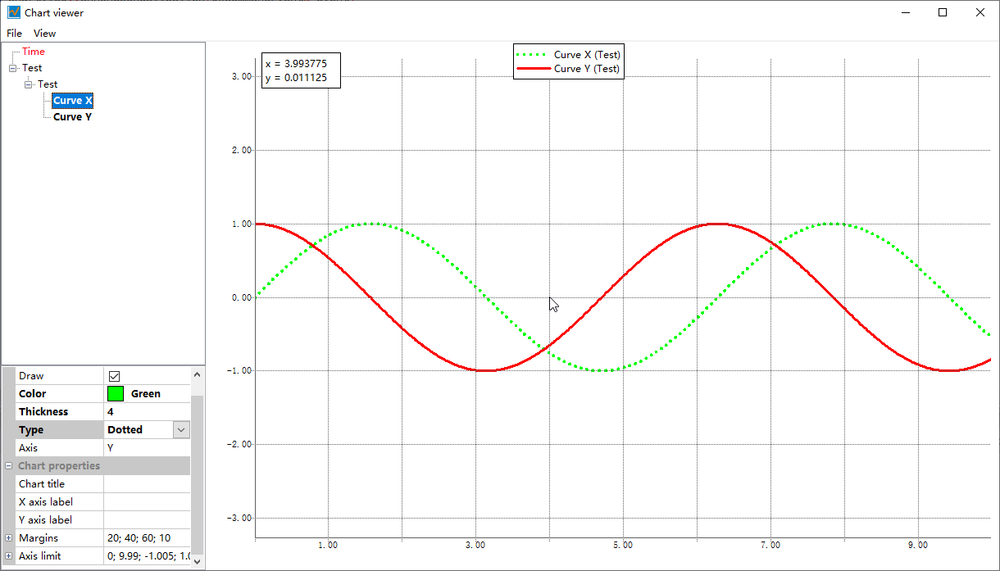

This is the screen shot when you run the test application.

I'm currently build this project through Code::Blocks, you can open the `ChartView.cbp`.

The original author built this project through CodeLite, you can open the `ChartView.workspace`.

